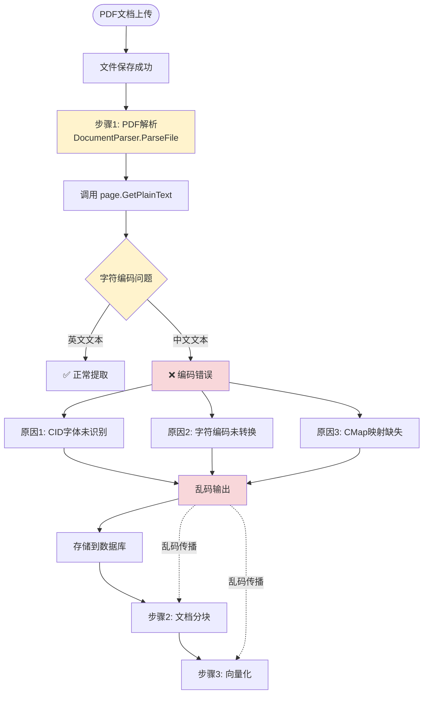

# PDF文档乱码问题诊断与修复方案

## 🔍 问题分析

### 症状描述

从您提供的乱码示例来看：
```
© 2006 C4Media Inc. HC@ C4Media / InfoQ.com ÙoöÑ>:úHF ,f^ InfoQ oöÑf ¨S¢- InfoQ þf ÷Tû books@c4media.com *ÏúH`H`fb¸ï åûU¹ 6­,fûUè ,fûU è (p7 X¨ïÍ (ûß åûU¹ÛL5P :° pU6Ib ­
```

**观察结果：**
- ✅ 部分英文可读：`© 2006 C4Media Inc.`, `C4Media / InfoQ.com`, `InfoQ`, `books@c4media.com`
- ❌ 中文和特殊字符变成乱码：`ÙoöÑ`, `úHF`, `f^`, `oöÑf`, `¨S¢-`, `þf ÷Tû`

### 根本原因

**问题出在：PDF解析阶段（步骤1）**

当前使用的PDF库 `github.com/ledongthuc/pdf` 在处理包含中文的PDF时存在以下问题：

1. **字符编码识别失败**
   - PDF内部可能使用CID字体（复合字体，常用于中文PDF）
   - 库的 `GetPlainText()` 方法可能无法正确识别字符编码
   - 直接将字节序列当作UTF-8处理，导致编码错误

2. **字体映射缺失**
   - 中文PDF通常使用嵌入字体或CID字体
   - 库可能没有正确解析字体编码表（CMap）
   - 导致字符映射错误

3. **编码转换缺失**
   - PDF内部可能使用多种编码（如GBK、GB2312、UTF-16等）
   - 库没有进行编码检测和转换
   - 直接输出原始字节序列

## 📊 问题定位流程图



## ✅ 解决方案

### 方案1: 更换PDF解析库（推荐）

**推荐使用更强大的PDF解析库：**

1. **`github.com/gen2brain/go-fitz`** (MuPDF绑定)
   - ✅ 对中文支持更好
   - ✅ 支持CID字体
   - ✅ 自动处理字符编码

2. **`github.com/unidoc/unipdf`** (商业/开源)
   - ✅ 专业PDF处理库
   - ✅ 完整支持中文
   - ⚠️ 商业使用需要许可证

3. **`github.com/pdfcpu/pdfcpu`**
   - ✅ 功能强大
   - ✅ 支持文本提取
   - ⚠️ 对中文支持可能有限

### 方案2: 增强当前库的编码处理

如果继续使用 `github.com/ledongthuc/pdf`，需要添加编码检测和转换：

```go
import (
    "golang.org/x/text/encoding/simplifiedchinese"
    "golang.org/x/text/transform"
)

func (p *DocumentParser) parsePDFWithEncoding(filePath string) (string, error) {
    // ... 现有解析代码 ...
    
    text, err := page.GetPlainText(nil)
    if err != nil {
        continue
    }
    
    // 尝试多种编码转换
    text = p.tryDecodeText(text)
    
    // ... 后续处理 ...
}

func (p *DocumentParser) tryDecodeText(text string) string {
    // 1. 检查是否为有效UTF-8
    if utf8.ValidString(text) {
        return text
    }
    
    // 2. 尝试GBK编码
    if decoded, err := simplifiedchinese.GBK.NewDecoder().String(text); err == nil {
        if utf8.ValidString(decoded) {
            return decoded
        }
    }
    
    // 3. 尝试GB18030编码
    if decoded, err := simplifiedchinese.GB18030.NewDecoder().String(text); err == nil {
        if utf8.ValidString(decoded) {
            return decoded
        }
    }
    
    // 4. 如果都失败，清理无效字符
    return cleanInvalidUTF8(text)
}
```

### 方案3: 使用OCR（最后手段）

如果PDF是扫描版或编码问题无法解决：

```go
// 使用OCR库提取文本
// 例如: github.com/otiai10/gosseract (Tesseract绑定)
```

## 🔧 实施建议

### 优先级1: 立即修复（短期）

1. **添加编码检测和转换**
   - 在 `document_parser.go` 中添加编码检测逻辑
   - 尝试多种编码（UTF-8, GBK, GB18030）
   - 选择最合适的编码进行转换

2. **增强错误处理**
   - 检测乱码模式
   - 记录编码问题日志
   - 提供重试机制

### 优先级2: 长期优化（中期）

1. **评估并更换PDF库**
   - 测试 `go-fitz` 对中文PDF的支持
   - 如果效果好，逐步迁移
   - 保留当前库作为备用

2. **添加PDF预处理**
   - 检测PDF编码信息
   - 提取字体信息
   - 根据PDF特性选择解析策略

### 优先级3: 完善监控（长期）

1. **添加质量检测**
   - 检测提取文本中的乱码比例
   - 自动标记有问题的文档
   - 提供手动重处理功能

2. **用户反馈机制**
   - 允许用户报告乱码问题
   - 自动触发重处理
   - 收集问题PDF样本用于改进

## 📝 代码修改示例

### 修改 document_parser.go

```go
// 添加编码检测和转换
import (
    "golang.org/x/text/encoding/simplifiedchinese"
    "golang.org/x/text/encoding/traditionalchinese"
    "golang.org/x/text/transform"
)

// 在 parsePDF 方法中，GetPlainText 之后添加：
text, err := page.GetPlainText(nil)
if err != nil {
    continue
}

// 尝试修复编码
text = p.fixTextEncoding(text)

// 新增方法
func (p *DocumentParser) fixTextEncoding(text string) string {
    // 如果已经是有效UTF-8，直接返回
    if utf8.ValidString(text) {
        // 检查是否包含乱码模式（大量非ASCII但非中文的字符）
        if p.isLikelyGarbled(text) {
            // 尝试重新编码
            return p.tryReencode(text)
        }
        return text
    }
    
    // 尝试各种编码
    encodings := []struct {
        name string
        dec  transform.Transformer
    }{
        {"GBK", simplifiedchinese.GBK.NewDecoder()},
        {"GB18030", simplifiedchinese.GB18030.NewDecoder()},
        {"Big5", traditionalchinese.Big5.NewDecoder()},
    }
    
    for _, enc := range encodings {
        decoded, _, err := transform.String(enc.dec, text)
        if err == nil && utf8.ValidString(decoded) {
            log.Printf("Successfully decoded text using %s encoding", enc.name)
            return decoded
        }
    }
    
    // 如果都失败，清理无效字符
    log.Printf("Warning: Failed to decode text, cleaning invalid UTF-8")
    return cleanInvalidUTF8(text)
}

func (p *DocumentParser) isLikelyGarbled(text string) bool {
    // 检测乱码模式：大量非ASCII但非中文字符
    nonASCII := 0
    chinese := 0
    
    for _, r := range text {
        if r > 127 {
            nonASCII++
            // 检查是否为中文字符范围
            if (r >= 0x4E00 && r <= 0x9FFF) || // CJK统一汉字
               (r >= 0x3400 && r <= 0x4DBF) || // CJK扩展A
               (r >= 0x20000 && r <= 0x2A6DF) { // CJK扩展B
                chinese++
            }
        }
    }
    
    // 如果非ASCII字符很多但中文字符很少，可能是乱码
    return nonASCII > 100 && chinese < nonASCII/10
}

func (p *DocumentParser) tryReencode(text string) string {
    // 将文本转换为字节，然后尝试不同编码
    bytes := []byte(text)
    
    // 尝试GBK编码
    if decoded, err := simplifiedchinese.GBK.NewDecoder().Bytes(bytes); err == nil {
        result := string(decoded)
        if utf8.ValidString(result) && p.hasChineseChars(result) {
            return result
        }
    }
    
    return text
}

func (p *DocumentParser) hasChineseChars(text string) bool {
    for _, r := range text {
        if (r >= 0x4E00 && r <= 0x9FFF) ||
           (r >= 0x3400 && r <= 0x4DBF) {
            return true
        }
    }
    return false
}
```

## 🧪 测试建议

1. **准备测试PDF**
   - 包含中文的PDF文档
   - 不同编码的PDF（UTF-8, GBK, GB18030）
   - 扫描版PDF（OCR测试）

2. **验证步骤**
   - 上传测试PDF
   - 检查提取的文本内容
   - 验证chunks中的文本质量
   - 测试语义搜索准确性

3. **性能测试**
   - 大文件处理时间
   - 内存使用情况
   - 编码转换开销

## 📌 总结

**问题定位：** PDF解析阶段（步骤1）- 字符编码处理失败

**主要原因：**
1. PDF库无法正确识别CID字体编码
2. 缺少字符编码检测和转换
3. 直接输出原始字节序列

**推荐方案：**
1. 短期：添加编码检测和转换逻辑
2. 中期：评估并更换更强大的PDF库（如go-fitz）
3. 长期：完善质量监控和用户反馈机制

