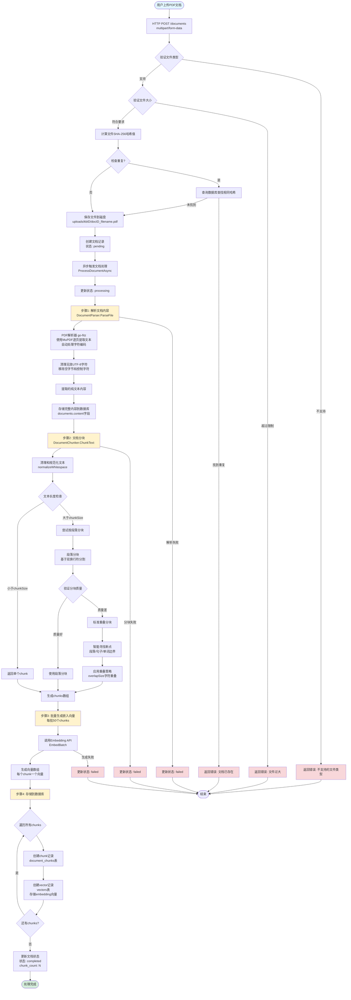

# PDF文档解析为知识库文档块流程

> **更新说明**: 已更换PDF解析库为 `go-fitz` (MuPDF绑定)，以改善中文支持。详见 [PDF库更换实施报告](./PDF库更换实施报告.md)

## 流程图



## 详细步骤说明

### 1. 文档上传阶段

**入口**: `DocumentHandler.UploadDocument()`

- **文件验证**
  - 支持的文件类型: `.pdf`, `.doc`, `.docx`, `.md`, `.txt`, `.html`, `.htm`, `.xlsx`, `.xls`, `.pptx`, `.ppt`
  - 文件大小限制: 可配置（默认值在配置中）
  
- **去重检查**
  - 计算文件SHA-256哈希值
  - 可选检查数据库中是否存在相同哈希的文档
  
- **文件保存**
  - 保存路径: `{uploadDir}/{kbID}/{docID}_{filename}`
  - 创建文档记录，状态设为 `pending`

### 2. 文档解析阶段

**组件**: `DocumentParser.ParseFile()`

**PDF解析流程**:
```go
1. 打开PDF文件 (github.com/gen2brain/go-fitz - MuPDF绑定)
2. 遍历每一页:
   - 提取页面纯文本 (doc.Text(pageNum))
   - go-fitz自动处理字符编码（支持CID字体、中文等）
   - 验证UTF-8编码（安全措施）
   - 清理无效字符
   - 追加到内容缓冲区
3. 返回完整文本内容
```

**注意**: 已从 `ledongthuc/pdf` 更换为 `go-fitz`，以改善中文PDF支持。详见 [PDF库更换实施报告](./PDF库更换实施报告.md)

**文本清理**:
- 移除空字节 (0x00) - PostgreSQL无法存储
- 移除控制字符（保留换行符、制表符）
- 移除无效Unicode字符
- 移除Unicode替换字符 (\uFFFD)

### 3. 文档分块阶段

**组件**: `DocumentChunker.ChunkText()`

**分块策略**:

1. **段落优先分块** (优先使用)
   - 基于双换行符 (`\n\n`) 分割段落
   - 合并段落直到达到 `chunkSize`
   - 验证分块质量（不能太小）

2. **标准重叠分块** (备用方案)
   - 按 `chunkSize` 字符数分割
   - 智能寻找断点:
     - 优先: 段落边界
     - 其次: 句子边界 (`.`, `!`, `?`, `。`, `！`, `？`)
     - 最后: 单词边界 (空格、标点)
   - 应用重叠: 下一个chunk从 `end - overlapSize` 开始

**分块参数**:
- `chunkSize`: 每个chunk的字符数（可配置，默认值在配置中）
- `overlapSize`: chunk之间的重叠字符数（可配置）

### 4. 向量化阶段

**组件**: `DocumentProcessor.ProcessDocument()`

**批量处理**:
- 每批处理50个chunks（避免API超时）
- 调用 `EmbeddingClient.EmbedBatch()` 生成向量
- 超时设置: 120秒（可配置）

**向量存储**:
- 每个chunk生成一个embedding向量
- 向量维度由embedding模型决定
- 存储模型名称用于版本追踪

### 5. 数据存储阶段

**数据库表结构**:

1. **documents表**
   - 存储文档元信息
   - `content`: 完整文本内容（清理后）
   - `status`: pending → processing → completed/failed
   - `chunk_count`: 生成的chunk数量

2. **document_chunks表**
   - 存储每个文档块
   - `chunk_index`: 块在文档中的索引
   - `content`: 块文本内容
   - `content_length`: 块长度

3. **vectors表**
   - 存储embedding向量
   - `embedding`: 向量数据（PostgreSQL vector类型）
   - `model`: 使用的embedding模型名称
   - 关联到 `chunk_id`

## 关键配置参数

| 参数 | 说明 | 默认值/位置 |
|------|------|------------|
| `chunkSize` | 每个chunk的字符数 | 配置文件中 |
| `overlapSize` | chunk重叠字符数 | 配置文件中 |
| `maxFileSize` | 最大文件大小 | 配置文件中 |
| `maxContentLength` | 最大内容长度 | 配置文件中 |
| `batchSize` | 批量处理chunk数量 | 50 (硬编码) |
| `embeddingTimeout` | Embedding API超时 | 120秒 |

## 错误处理

- **解析失败**: 更新状态为 `failed`，记录错误日志
- **分块失败**: 如果未生成任何chunk，标记为失败
- **向量化失败**: 批量处理失败时，整个文档标记为失败
- **存储失败**: 单个chunk/vector存储失败时记录警告，继续处理其他chunks

## 异步处理

文档处理在独立的goroutine中异步执行，不会阻塞上传请求的响应。用户可以通过查询文档状态API来跟踪处理进度。

